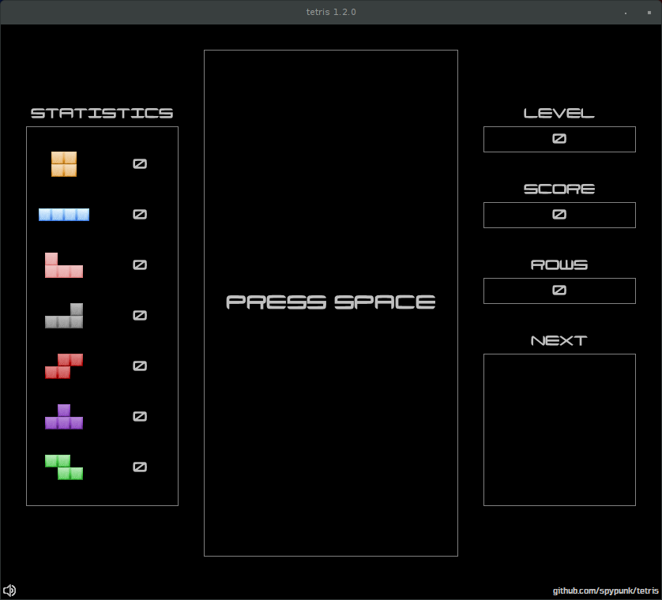
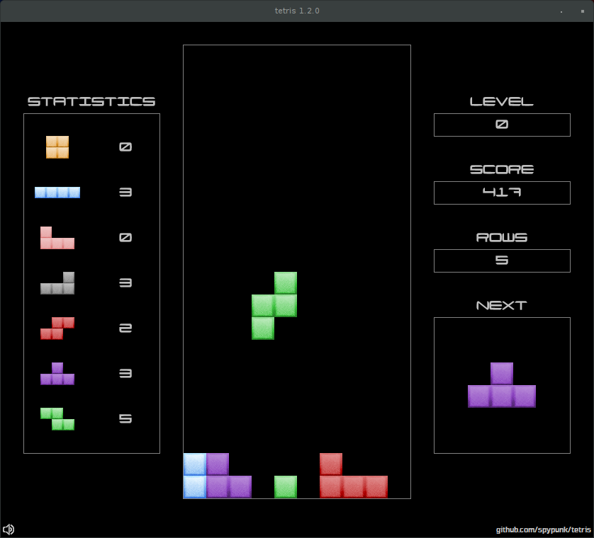
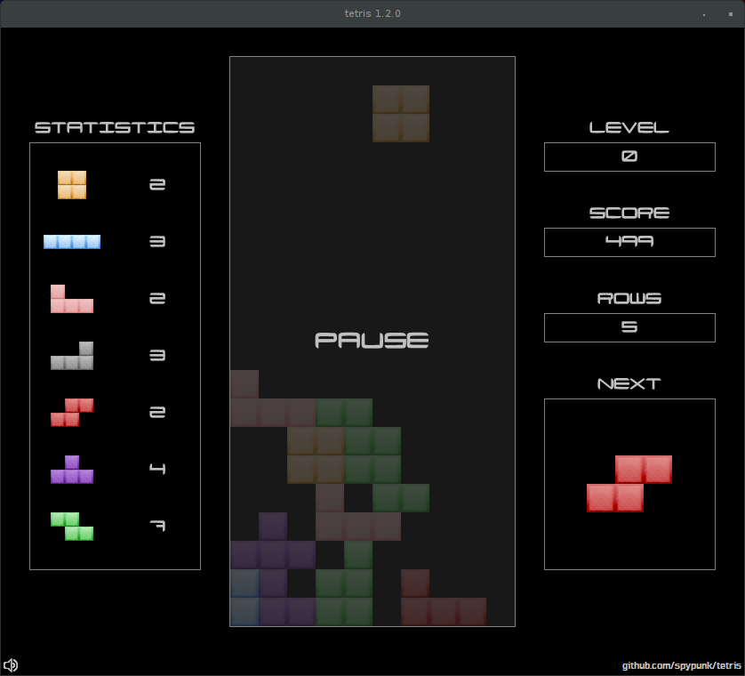
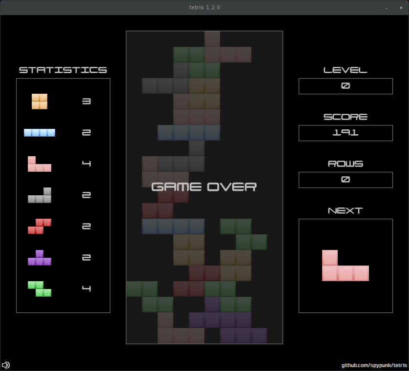

# tetris - Just another Tetris™ clone 

[](https://github.com/spypunk/tetris/releases/tag/1.13.0) [](https://travis-ci.org/spypunk/tetris) [](https://www.codacy.com/app/spypunk/tetris?utm_source=github.com&utm_medium=referral&utm_content=spypunk/tetris&utm_campaign=Badge_Grade) [](https://sourceforge.net/projects/spypunk-tetris/files/latest/download) [](http://www.wtfpl.net/)

## How it looks ?









## How to Build

### Prerequisites
- Java JDK 8 or higher
- Apache Maven 3 or higher

### Build the game

#### If you want to build the release manually:

```bash
mvn clean package
```

### Run the game

After building, you can start the game with the provided script:

```bash
./tetris
```

Alternatively, you can run the JAR directly:

```bash
java -jar target/tetris.jar
```

## How to play ?

- SPACE - Start a new game

- LEFT - Move the current shape to the left

- RIGHT - Move the current shape to the right

- DOWN - Move the current shape down

- UP - Rotate the current shape clockwise

- CTRL - "Hard drop" current shape

- P - Pause the current game

- M - Mute all

- N - Mute music

- PAGE UP - Increase the volume

- PAGE DOWN - Decrease the volume

## What about license ?

This project is licensed under the WTFPL (Do What The Fuck You Want To Public License, Version 2)

[](http://www.wtfpl.net/)

Copyright © 2016-2017 spypunk [spypunk@gmail.com](mailto:spypunk@gmail.com)

This work is free. You can redistribute it and/or modify it under the terms of the Do What The Fuck You Want To Public License, Version 2, as published by Sam Hocevar. See the COPYING file for more details.
